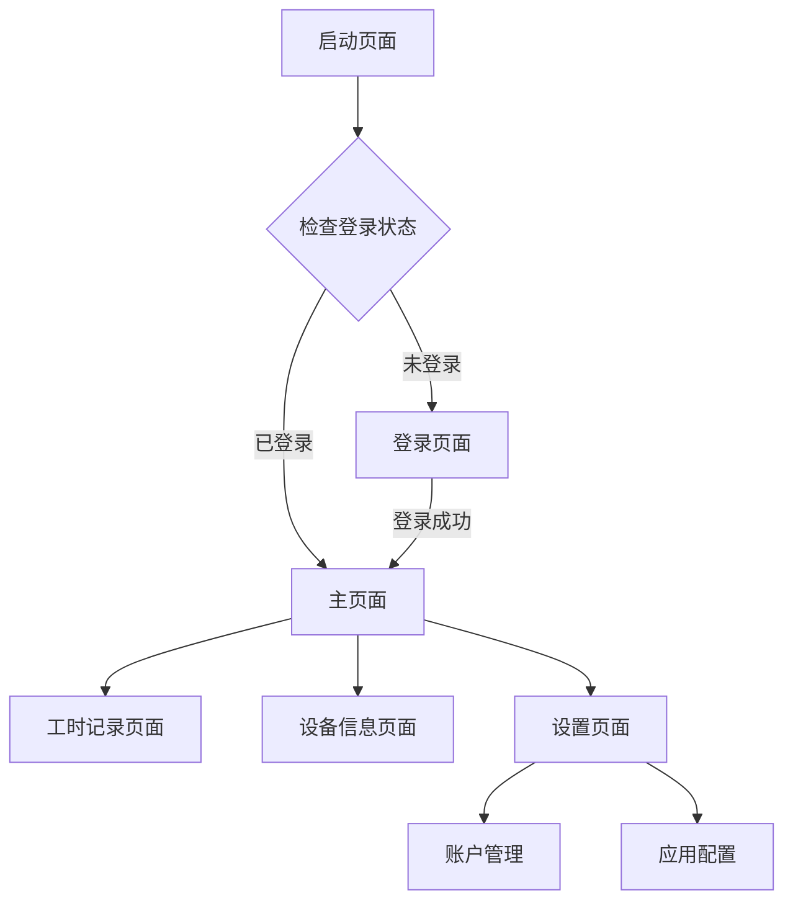

# OneOS 产品需求文档

## 1. Product Overview
OneOS是一个基于Flutter开发的跨平台移动操作系统模拟器应用。该应用提供类似桌面操作系统的用户界面体验，集成了用户认证、应用管理、工时记录等核心功能，旨在为用户提供统一的移动端工作平台。

项目面向需要移动端办公和时间管理的用户群体，通过模拟操作系统界面提供直观的应用访问方式，帮助用户提高工作效率和时间管理能力。

## 2. Core Features

### 2.1 User Roles
| Role | Registration Method | Core Permissions |
|------|---------------------|------------------|
| 管理员用户 | PocketBase后台注册 | 完整系统访问权限，可管理所有功能模块 |
| 普通用户 | 应用内登录 | 基础功能访问，工时记录，设备信息查看 |

### 2.2 Feature Module
我们的OneOS应用包含以下主要页面：
1. **启动页面**：应用启动检查，用户认证状态验证
2. **登录页面**：用户身份验证，账户登录功能
3. **主页面**：类桌面应用网格，快速应用访问
4. **工时记录页面**：工作时间记录，时间统计分析
5. **设备信息页面**：设备硬件信息展示
6. **设置页面**：应用配置，用户偏好设置

### 2.3 Page Details
| Page Name | Module Name | Feature description |
|-----------|-------------|---------------------|
| 启动页面 | 启动检查模块 | 显示应用Logo和名称，检查用户登录状态，自动跳转到相应页面 |
| 登录页面 | 用户认证模块 | 提供邮箱密码登录表单，验证用户身份，错误提示显示，登录状态持久化 |
| 主页面 | 应用网格模块 | 4x4网格布局展示应用图标，渐变背景设计，应用点击响应 |
| 主页面 | 底部Dock模块 | 固定底部应用快捷栏，常用应用快速访问 |
| 工时记录页面 | 时间记录模块 | 工作时间开始/结束记录，时间统计展示，历史记录查看 |
| 设备信息页面 | 设备信息模块 | 显示设备型号、系统版本、硬件参数等详细信息 |
| 设置页面 | 配置管理模块 | 用户偏好设置，账户管理，应用配置选项 |

## 3. Core Process
**用户操作流程：**
用户启动应用后，系统自动检查登录状态。未登录用户将跳转到登录页面进行身份验证，验证成功后进入主页面。在主页面，用户可以通过点击应用图标访问各种功能模块，包括工时记录、设备信息查看、系统设置等。用户可以随时通过设置页面进行账户管理和应用配置。

## 4. User Interface Design
### 4.1 Design Style
- **主色调**：深紫色(#673AB7)作为主色，蓝色(#2196F3)作为辅助色
- **按钮样式**：圆角矩形按钮，Material Design 3.0风格
- **字体**：系统默认字体，标题使用粗体，正文使用常规字重
- **布局风格**：卡片式布局，网格排列，渐变背景设计
- **图标风格**：Material Icons图标库，简洁现代的线性图标

### 4.2 Page Design Overview
| Page Name | Module Name | UI Elements |
|-----------|-------------|-------------|
| 启动页面 | 启动检查模块 | 居中Logo图标(电脑图标)，应用名称，加载指示器，渐变背景 |
| 登录页面 | 用户认证模块 | 邮箱输入框，密码输入框，登录按钮，错误提示文本，简洁白色背景 |
| 主页面 | 应用网格模块 | 4x4网格布局，圆角白色卡片，彩色图标，蓝紫渐变背景 |
| 主页面 | 底部Dock模块 | 半透明白色容器，圆角设计，4个常用应用图标 |
| 工时记录页面 | 时间记录模块 | 时间显示卡片，开始/停止按钮，统计图表，列表视图 |
| 设备信息页面 | 设备信息模块 | 信息卡片布局，图标+文本组合，分组显示 |
| 设置页面 | 配置管理模块 | 列表项布局，图标+标题+箭头，分组设置选项 |

### 4.3 Responsiveness
应用采用移动端优先设计，支持多种屏幕尺寸自适应。使用Flutter的响应式布局组件确保在不同设备上的良好显示效果，支持触摸交互优化，包括点击反馈和手势操作。