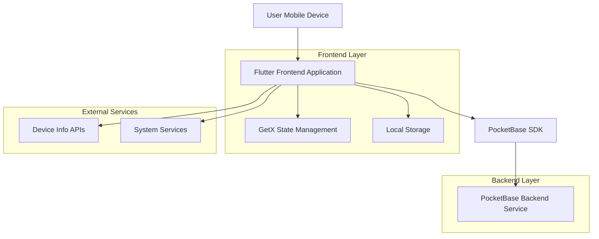
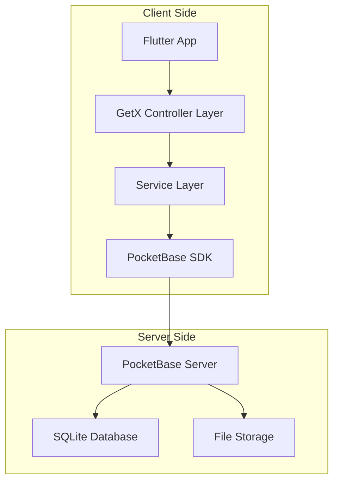
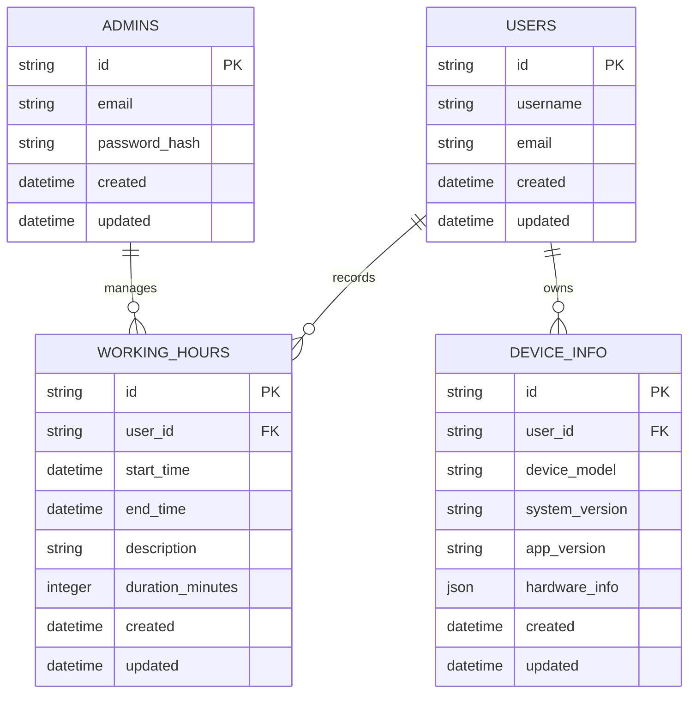

# OneOS 技术架构文档

## 1. Architecture design



## 2. Technology Description

* Frontend: Flutter\@3.8.1 + GetX\@4.6.6 + Material Design 3

* Backend: PocketBase\@0.23.0 (自托管后端服务)

* State Management: GetX (状态管理、路由、依赖注入)

* Local Storage: SharedPreferences\@2.2.2

* UI Framework: Flutter ScreenUtil\@5.9.0 (屏幕适配)

* Network: PocketBase SDK (HTTP客户端)

* Device APIs: device\_info\_plus\@10.1.0

## 3. Route definitions

| Route          | Purpose            |
| -------------- | ------------------ |
| /              | 启动页面，检查用户认证状态并自动跳转 |
| /login         | 登录页面，用户身份验证和账户登录   |
| /home          | 主页面，类桌面应用网格和快速访问   |
| /working-hours | 工时记录页面，工作时间记录和统计   |
| /device-info   | 设备信息页面，显示设备硬件和系统信息 |
| /settings      | 设置页面，用户偏好和应用配置管理   |

## 4. API definitions

### 4.1 Core API

用户认证相关

```
POST /api/admins/auth-with-password
```

Request:

| Param Name | Param Type | isRequired | Description |
| ---------- | ---------- | ---------- | ----------- |
| identity   | string     | true       | 管理员邮箱地址     |
| password   | string     | true       | 管理员密码       |

Response:

| Param Name | Param Type | Description |
| ---------- | ---------- | ----------- |
| token      | string     | JWT认证令牌     |
| admin      | object     | 管理员用户信息     |

Example

```json
{
  "identity": "admin@example.com",
  "password": "password123"
}
```

工时记录相关

```
POST /api/collections/working_hours/records
```

Request:

| Param Name  | Param Type | isRequired | Description |
| ----------- | ---------- | ---------- | ----------- |
| user\_id    | string     | true       | 用户ID        |
| start\_time | datetime   | true       | 开始时间        |
| end\_time   | datetime   | false      | 结束时间        |
| description | string     | false      | 工作描述        |

Response:

| Param Name | Param Type | Description |
| ---------- | ---------- | ----------- |
| id         | string     | 记录ID        |
| created    | datetime   | 创建时间        |
| updated    | datetime   | 更新时间        |

## 5. Server architecture diagram



## 6. Data model

### 6.1 Data model definition



### 6.2 Data Definition Language

管理员表 (admins)

```sql
-- PocketBase内置管理员表，无需手动创建
-- 包含id, email, passwordHash, created, updated等字段
```

用户表 (users)

```sql
-- 创建用户集合
CREATE COLLECTION users (
  id TEXT PRIMARY KEY,
  username TEXT UNIQUE NOT NULL,
  email TEXT UNIQUE NOT NULL,
  created DATETIME DEFAULT CURRENT_TIMESTAMP,
  updated DATETIME DEFAULT CURRENT_TIMESTAMP
);

-- 创建索引
CREATE INDEX idx_users_email ON users(email);
CREATE INDEX idx_users_username ON users(username);
```

工时记录表 (working\_hours)

```sql
-- 创建工时记录集合
CREATE COLLECTION working_hours (
  id TEXT PRIMARY KEY,
  user_id TEXT NOT NULL,
  start_time DATETIME NOT NULL,
  end_time DATETIME,
  description TEXT,
  duration_minutes INTEGER,
  created DATETIME DEFAULT CURRENT_TIMESTAMP,
  updated DATETIME DEFAULT CURRENT_TIMESTAMP
);

-- 创建索引
CREATE INDEX idx_working_hours_user_id ON working_hours(user_id);
CREATE INDEX idx_working_hours_start_time ON working_hours(start_time DESC);
CREATE INDEX idx_working_hours_created ON working_hours(created DESC);

-- 初始化数据
INSERT INTO working_hours (user_id, start_time, end_time, description, duration_minutes)
VALUES 
  ('user_001', '2024-01-15 09:00:00', '2024-01-15 17:30:00', '日常开发工作', 510),
  ('user_001', '2024-01-16 08:30:00', '2024-01-16 18:00:00', '项目需求分析', 570);
```

设备信息表 (device\_info)

```sql
-- 创建设备信息集合
CREATE COLLECTION device_info (
  id TEXT PRIMARY KEY,
  user_id TEXT NOT NULL,
  device_model TEXT,
  system_version TEXT,
  app_version TEXT,
  hardware_info JSON,
  created DATETIME DEFAULT CURRENT_TIMESTAMP,
  updated DATETIME DEFAULT CURRENT_TIMESTAMP
);

-- 创建索引
CREATE INDEX idx_device_info_user_id ON device_info(user_id);
CREATE INDEX idx_device_info_created ON device_info(created DESC);
```

